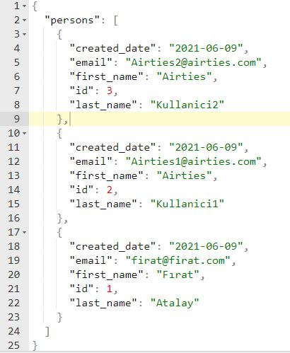

# Airties Assesment

Python Version 3.9

### Installation 
 **Windows**
   
	py -3.9 -m venv venv
	venv/Scripts/activate
	pip install -r requirements.txt

### 1. Problem - DayOfWeek
 
- Days of the week are represented as three-letter strings ("Mon", "Tue", "Wed", "Thu", "Fri", "Sat", "Sun").
- Write a function solution that, given a string S representing the day of the week and an integer K (between 0 and 500, inclusive), returns the day of the week that is K days later.
- For example, given S = "Wed" and K = 2, the function should return "Fri". Given S = "Sat" and K = 23, the function should return "Mon".

	How To Run DayOfWeek?
   1. Open the **DayOfWeek.py** file
   2. Add a print command end of the file like this : **print(day_of_week("Mon", 5))**
   3. When you run this file, you will see from S day to K days.

### 2. Problem - StringRepeat

- Write a function solution that returns a string of length N consisting of alternating characters: "+" and "-", starting with a "+" character. 
- You can assume N is between 1 and 100.
- For example, given N = 5, your function should return "+-+-+" and given N = 4, it should return "+-+-".

	How To Run StringRepeat?
   1. Open the **StringRepeat.py** file
   2. Add a print command end of the file like this : **print(StringRepeat(5))**
   3. When you run this file, you will see answer like this : +-+-+

### 3. Problem - RestPerson

- The endpoint must be created to retrieve a list of data; it will not need to retrieve a singular record.
- The data must be ordered by the created_date field, and the first record to show in the response must be the newest record created.
- The response from the API should only contain the Id, first_name, last_name, email and created_date fields.
- Create an API that will only allow data to be read. 
- Documentation
- You can assume that the Person model is correct and contains the required data in the database.
- The name of the API is persons.
- There is no need to create an authentication mode.

	How To Run RestPerson?
  1. Open **db.py**
  2. Make the comment lines on lines 33, 35 and 36 lines of code. Delete "#" operator.
 
           33. #createTable(),   
           35. #for person in persons: 
           36. #addData(*person)  
  3. Run **db.py**, After that **db.sqlite** will be created and datas will be added to DB.
  4. Comment lines 33, 35 and 36 again.Otherwise it will create the same tables and files when it runs.
  5. Open **views.py** and run it. it will be ran on http://127.0.0.1:5000/persons server. 
  6. You will see datas from DB like this: 

	

